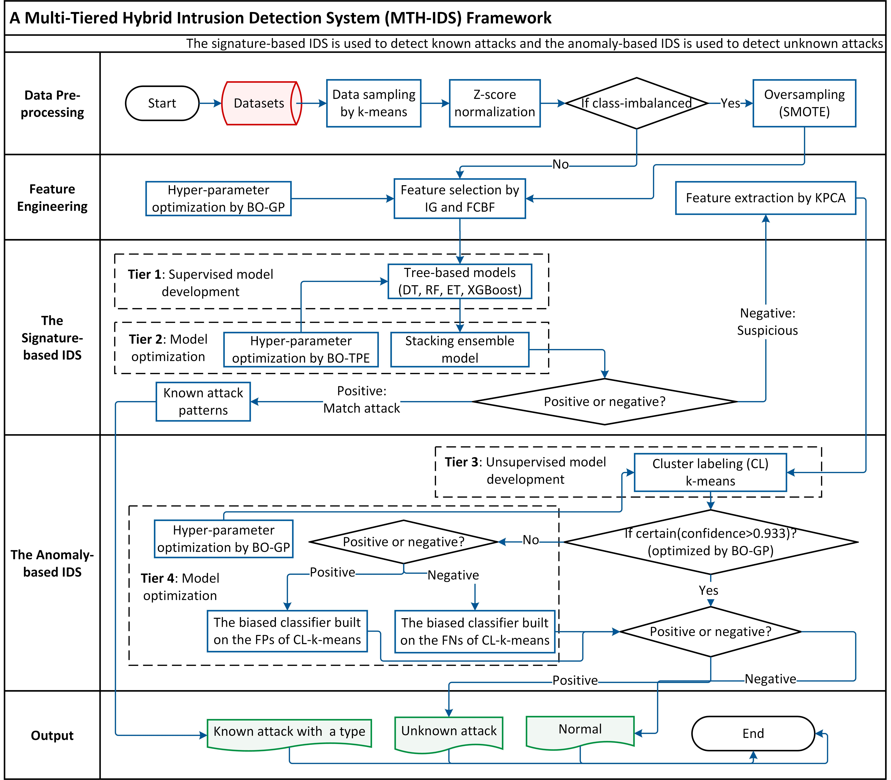

# Multi-Tiered Hybrid Intrusion Detection System for Internet of Vehicles (IoV) 🚗

---
### **Group 10 in Course 4371:**

-   Logan Falkenberg
-   Brad Hayes
-   Phillip Henry
-   Angela Noronha
-   Collin Reisman
---

   

## Project Overview 🌟

Welcome to the **Multi-Tiered Hybrid Intrusion Detection System for Internet of Vehicles (IoV)**! This cutting-edge project is engineered to bolster the security of vehicular networks through a sophisticated, layered approach that detects and prevents intrusions. By harnessing the power of machine learning algorithms and real-time data analysis, our system identifies and mitigates potential threats, ensuring robust protection for connected vehicles in an increasingly interconnected world.




## Table of Contents

- [Multi-Tiered Hybrid Intrusion Detection System for Internet of Vehicles (IoV) 🚗](#multi-tiered-hybrid-intrusion-detection-system-for-internet-of-vehicles-iov-)
    - [**Group 10 in Course 4371:**](#group-10-in-course-4371)
  - [Project Overview 🌟](#project-overview-)
  - [Table of Contents](#table-of-contents)
  - [Repository 📂](#repository-)
  - [Installation Guide ⚙️](#installation-guide-️)
    - [Prerequisites 🔧](#prerequisites-)
    - [Step-by-Step Setup 🛠️](#step-by-step-setup-️)
      - [Clone the Repository 📥](#clone-the-repository-)
      - [Install Anaconda 📦](#install-anaconda-)
      - [Set Up Conda Environment 🐍](#set-up-conda-environment-)
      - [Install Essential Packages 📦](#install-essential-packages-)
      - [Set Up Jupyter Kernel 🔌](#set-up-jupyter-kernel-)
      - [Launch Jupyter Notebook 🚀](#launch-jupyter-notebook-)
    - [Subsequent Runs 🔄](#subsequent-runs-)
  - [Functionality 🔍](#functionality-)
    - [Implemented Algorithms 🧠](#implemented-algorithms-)
    - [Purpose of Implemented Functionalities 🎯](#purpose-of-implemented-functionalities-)
  - [Usage 💡](#usage-)
  - [References](#references)

## Repository 📂

Access the project repository on GitHub:

🔗 [4371-Project-Structure-For-Jupyter-Notebook](https://github.com/TheTallProgrammer/4371-Project-Structure-For-Jupyter-Notebook)


## Installation Guide ⚙️

To seamlessly run the codebase from our repository, follow the comprehensive steps outlined below. These instructions are tailored for our group's setup, though alternative methods may also be applicable.

### Prerequisites 🔧

Ensure you have the following tools installed on your machine:

-   **Git:** Version control system.  
    📥 [Download Git](https://git-scm.com/downloads)
    
-   **Anaconda:** Python environment manager.  
    📥 [Download Anaconda](https://www.anaconda.com/download/success)
    

### Step-by-Step Setup 🛠️

#### Clone the Repository 📥


Open your terminal or command prompt and clone the repository:

```bash
git clone https://github.com/TheTallProgrammer/4371-Project-Structure-For-Jupyter-Notebook.git
```

Navigate to the cloned directory:
```bash
cd 4371-Project-Structure-For-Jupyter-Notebook
```

#### Install Anaconda 📦


If Anaconda isn't installed, download it from the [Anaconda Download Page](https://www.anaconda.com/download/success) and follow the installation instructions for your operating system.

#### Set Up Conda Environment 🐍

Open the **Anaconda Powershell Prompt** (or **Anaconda Prompt** on Windows) and execute the following commands:

- ##### a. Update Conda

	- Ensure Conda is up to date:
		```bash
		conda update conda -y
		```

- ##### b. Create a New Environment

	- Create a Conda environment named `myenv` with Python 3.10:

		```bash
		conda create -n myenv python=3.10 -y
		```

- ##### c. Activate the Environment

	- Activate the newly created environment:

		```bash
		conda activate myenv
		```

#### Install Essential Packages 📦


Install the necessary Python packages:

```bash
conda install numpy=1.26.4 scipy scikit-learn notebook ipykernel -y
```

#### Set Up Jupyter Kernel 🔌


Register the Conda environment as a Jupyter kernel:

```bash
python -m ipykernel install --user --name myenv --display-name "Python (myenv)"
```

#### Launch Jupyter Notebook 🚀


Start Jupyter Notebook:

```bash
jupyter notebook
```

This command will open Jupyter Notebook in your default web browser.

### Subsequent Runs 🔄

For future sessions, simply perform the following steps:

1.  **Activate the Conda Environment:**
    
    ```bash
    conda activate myenv
    ```
    
2.  **Launch Jupyter Notebook:**
    
    ```bash
    jupyter notebook
    ```
    
3.  Navigate to the `MTH_IDS_IoTJ-enhanced.ipynb` file in the Jupyter interface and run the notebook as usual.
    


## Functionality 🔍

The **Multi-Tiered Hybrid Intrusion Detection System (MTH-IDS)** employs a tri-layered anomaly detection framework to enhance its capability in distinguishing between benign and malicious network traffic. This multi-tiered strategy ensures a more accurate and efficient intrusion detection mechanism by pre-filtering anomalies before the final threat detection stage.

### Implemented Algorithms 🧠

1.  **Isolation Forest (Logan Falkenberg)**
    
    -   **Purpose:** Detects and filters out outliers from the dataset before applying synthetic data balancing techniques like SMOTE.
    -   **Implementation Details:**
        -   Applied after Z-score normalization and before SMOTE to ensure data cleanliness.
        -   Parameters: `n_estimators=200`, `contamination='auto'`, `random_state=42`, `n_jobs=-1`.
        -   Filters out anomalies to prevent SMOTE from misclassifying anomalies as normal data, thereby reducing confusion in model training.
2.  **One-Class SVM (Brad Hayes)**
    
    -   **Purpose:** Learns the characteristics of normal data to effectively identify anomalies.
    -   **Implementation Details:**
        -   Utilizes a radial basis function (RBF) kernel with `gamma='auto'` and `nu=0.5`.
        -   Maps predictions to binary labels to align with the dataset's labeling convention.
        -   Evaluates model performance using classification reports and confusion matrices to ensure reliability.
3.  **Local Outlier Factor (LOF) (Collin)**
    
    -   **Purpose:** Identifies local density deviations of data points, effectively detecting outliers in the dataset.
    -   **Implementation Details:**
        -   Standardizes data before applying PCA for dimensionality reduction.
        -   Uses `n_neighbors=20` and `contamination=0.1` to fine-tune anomaly detection sensitivity.
        -   Visualizes anomaly scores and outlier distributions to assess detection thresholds and model performance.

### Purpose of Implemented Functionalities 🎯

Integrating these algorithms serves to **reduce the number of undiagnosed anomalies** within the system. By differentiating as many anomalies as possible—whether they are threats or benign network traffic—before the final threat detection stage, the system maintains a **filtered dataset**. This pre-filtering ensures that the intrusion detection mechanisms operate on high-quality, noise-reduced data, enhancing overall accuracy and efficiency.

**Key Benefits:**

-   **Enhanced Data Quality:** Removes noise and outliers, ensuring that the training data is clean and representative.
-   **Improved Model Performance:** Reduces confusion caused by synthetic data generation on anomalous points, leading to more reliable threat detection.
-   **Efficient Anomaly Management:** Differentiates between malicious and benign anomalies, allowing for targeted responses and better resource allocation.

**Note:** While these functionalities have been successfully implemented and tested within our group, there may be alternative methods or additional optimizations that can further enhance the system's capabilities.

## Usage 💡

Once the notebook is running, you can interact with the **Multi-Tiered Hybrid Intrusion Detection System** to:

-   **📊 Analyze Data:** Process and visualize data related to vehicular networks.
-   **🧠 Train Models:** Utilize machine learning algorithms to train intrusion detection models.
-   **🔍 Detect Intrusions:** Apply trained models to identify and respond to potential security threats in real-time.


## References

Yang et al. [1](#ref1) introduced **MTH-IDS**, a Multi-Tiered Hybrid Intrusion Detection System designed specifically for IoV. This system employs a layered approach, combining multiple detection techniques to enhance accuracy and reliability. By integrating signature-based and anomaly-based methods, MTH-IDS effectively identifies a wide range of cyber threats, ensuring comprehensive protection for vehicular networks.

Similarly, Wang et al. [2](#ref2) developed a **lightweight IDS** leveraging transfer learning and the MobileNetV2 architecture. Their approach emphasizes computational efficiency without compromising detection performance, making it ideal for resource-constrained IoV devices. The incorporation of hyper-parameter optimization further refines the system's ability to accurately detect intrusions, demonstrating a balance between speed and accuracy essential for real-time vehicular applications.

1.  <span id="ref1"></span> L. Yang, A. Moubayed, and A. Shami, "MTH-IDS: A Multitiered Hybrid Intrusion Detection System for Internet of Vehicles," _IEEE Internet of Things Journal_, vol. 9, no. 1, pp. 616–632, Jan. 2022, doi: [10.1109/JIOT.2021.3084796](https://doi.org/10.1109/JIOT.2021.3084796).
    
2.  <span id="ref2"></span> Y. Wang, G. Qin, M. Zou, _et al._, "A lightweight intrusion detection system for Internet of Vehicles based on transfer learning and MobileNetV2 with hyper-parameter optimization," _Multimedia Tools and Applications_, vol. 83, pp. 22347–22369, Mar. 2024, doi: [10.1007/s11042-023-15771-6](https://doi.org/10.1007/s11042-023-15771-6).